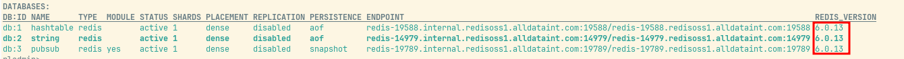
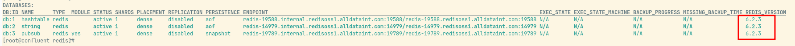
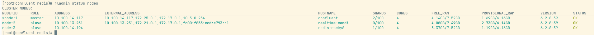
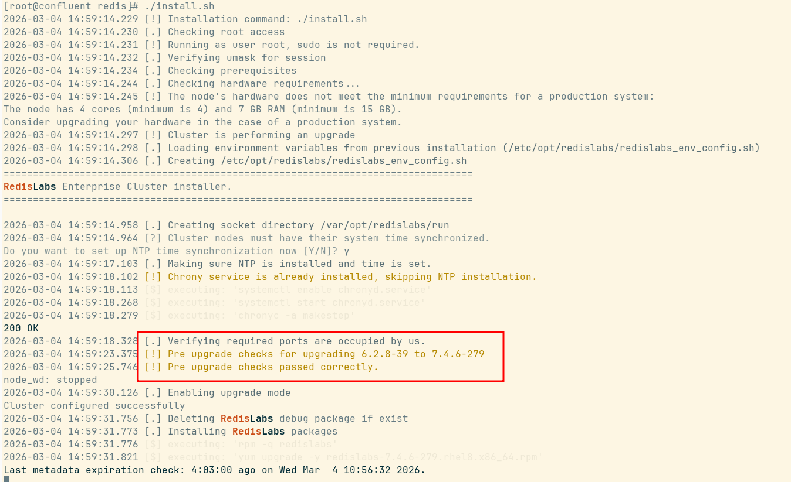
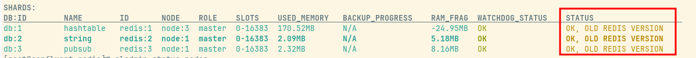
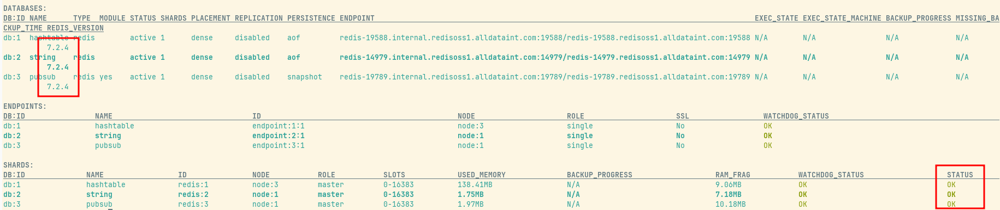
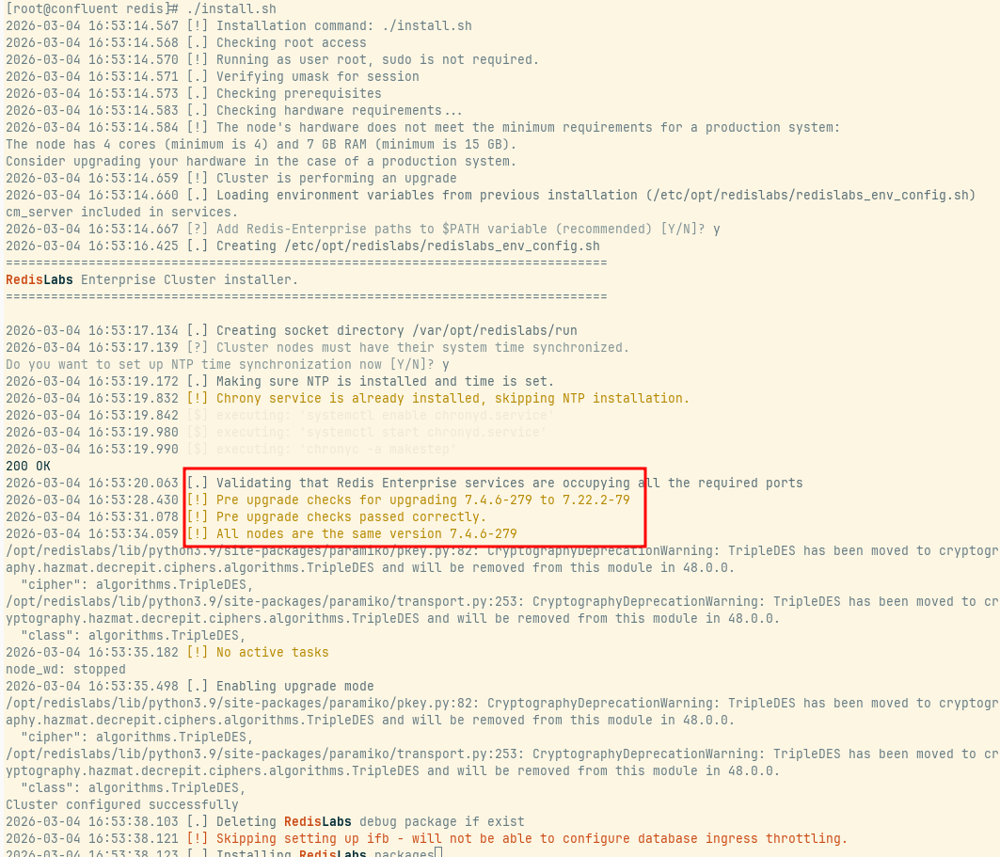
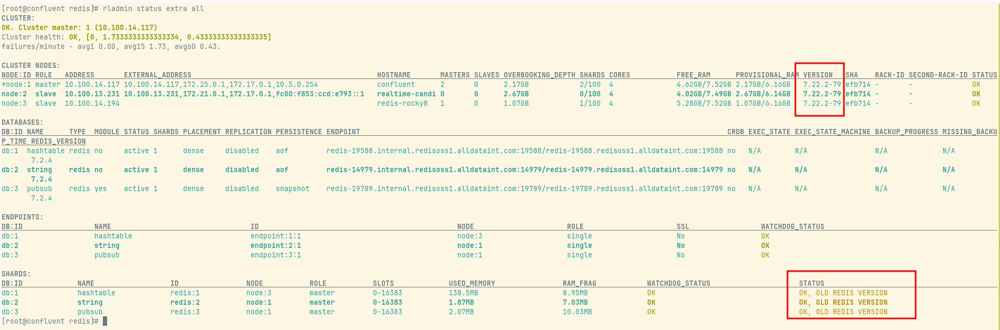
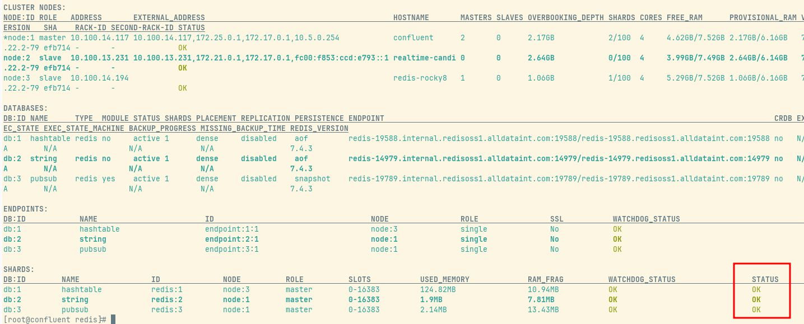

Note:
- Before you upgrade a cluster from Redis Software version 6.2.x to 7.8.x, you must follow these steps if the cluster has any databases with Redis version 6.0:

  1. Set the Redis upgrade policy to latest:

  `rladmin tune cluster redis_upgrade_policy latest`

  2. Upgrade Redis 6.0 databases to Redis 6.2. [link](https://redis.io/docs/latest/operate/rs/installing-upgrading/upgrading/upgrade-database/)

  - I think the reason for this is for compatibility with newer release versions that have different database versions for Redis.

| Redis Software | Bundled Redis Version        | Default |
| -------------- | ---------------------------- | ------- |
| 8.0.10         | 6.2, 7.2, 7.4, 8.0, 8.2, 8.4 | 8.4     |
| 8.0.6          | 6.2, 7.2, 7.4, 8.0, 8.2      | 8.2     |
| 8.0.2          | 6.2, 7.2, 7.4, 8.0, 8.2      | 8.2     |
| 7.22.x         | 6.2, 7.2, 7.4                | 7.4     |
| 7.8.x          | 6.2, 7.2, 7.4                | 7.4     |
| 7.4.x          | 6.0, 6.2, 7.2                | 7.2     |
| 7.2.4          | 6.0, 6.2, 7.2                | 7.2     |
| 6.4.2          | 6.0, 6.2                     | 6.2     |
| 6.2.x          | 6.0, 6.2                     | 6.0     |

   Because we want to upgrade from Redis version 6.2.x to 7.22.x, we need to make sure the database is already at least using the minimum available version for 7.22, which is database version 6.2.

   Before:
    

   Run this command to upgrade the database: `rladmin upgrade db <name of database | db id> preserve_roles`

   After:
    

3. Check supported upgrade paths [link](https://redis.io/docs/latest/operate/rs/installing-upgrading/upgrading/upgrade-cluster/#supported-upgrade-paths)
4. Verify that maintenance mode is not enabled.
5. Upgrade the cluster's primary (master) node first. To identify the primary node, use one of the following methods:
```
- **Nodes** screen in the new Cluster Manager UI (only available for Redis Software versions 7.2 and later)

- [`rladmin status nodes`](https://redis.io/docs/latest/operate/rs/references/cli-utilities/rladmin/status/#status-nodes) command

- [`GET /nodes/status`](https://redis.io/docs/latest/operate/rs/references/rest-api/requests/nodes/status/#get-all-nodes-status) REST API request
```





From this information, the master node is located at 10.100.14.117, so we upgrade this node to 7.4.x first by simply running the `./install.sh` script.




When we run `rladmin status extra all` after finishing the upgrade of the master node, we are going to see the old cluster version on the sharding status.



It turns out this is because the database is still using version 6.2, and Redis Software version 7.4.x marks that as an old Redis version. After running the database upgrade again to the latest available version for Redis Software 7.4, the status returns to normal with OK.




Now we are ready to upgrade from 7.4.x to 7.22.x.



Here is the status after the upgrade — like before, it still shows *Old Redis Version*.



After upgrading the database to 7.4, the status returns OK.

